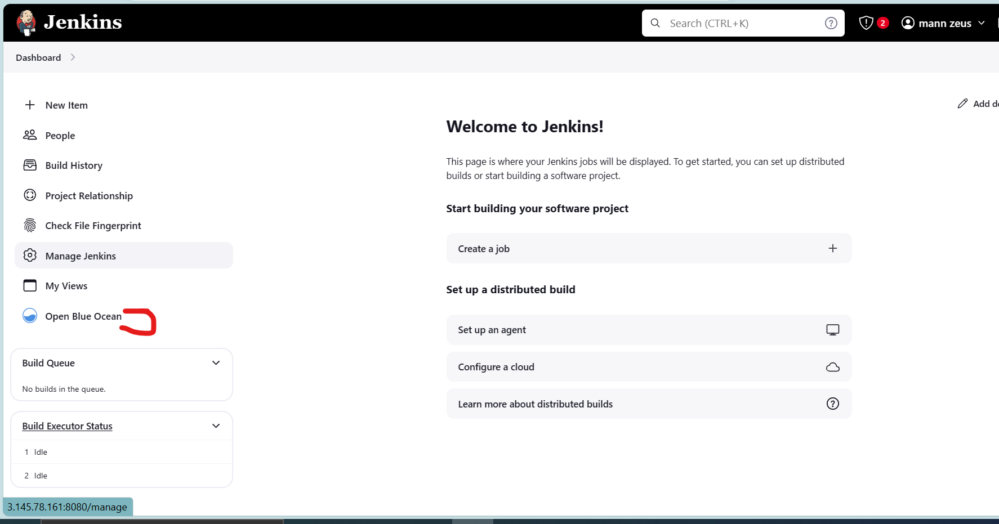

# MIGRATION TO THE СLOUD WITH CONTAINERIZATION. PART 1 – DOCKER & DOCKER COMPOSE

Never forget that the goal of DevOps is to make the software delivery process efficient, we've seen how we can use aid our strive towards this goal by this using IAC i.e terraform, we are going to use another tool today that is widely used by DevOps engineers to improve the efficiency of software delivery, DOCKER.

In this project we will work with docker containers to containerize appllication. We will do this both manually and via automation. We will automate the containerization of the Tooling App and a Todo App using multi branch pipeline with jenkins.

After achieving this manually , we will use the following tools to achieve automation:
- Packer and bash scripts to create an AMI for the server
- Terraform to automate server creation as well as automating the creation of repositories on the docker registry
- Jenkins as the CI tool
- Jenkins pipeline to build and push the image to the public registry 

## Deploy the Applications Manually

**Deploy MySql in a container.**

We start be assembling the database layer of the tooling application. Pull a MySql container, configure it and make sure it
is ready to receive requests from our PHP application.

**First create a network**
Applications created in the same network will be able to talk to each other using  just their container names, there will be no need to set up network rules to enable their connectivity to each other as they are already in the same network. 
Sometimes there might be a requirement to control the cidr range of the containers running the entire application stack, in these scenarios we will create a network and specify the --subnet.

In this instance we will be doin likewise, we will create a network with a subnet dedicated for our project and use it for both MySQL and the application  so that they can connect.


```
$docker network create --subnet=10.0.1.0/24 tooling_network

$docker network ls
```


**Pull and run mysql container**
```
$ docker run --network tooling_network -h mysqlhostserver --name=mysql -e MYSQL_ROOT_PASSWORD=<set a password> -d mysql/mysql-server:latest

$docker ps -a
```
Flags used

- -d runs the container in detached mode
- --network connects a container to a network
- -h specifies a hostname


**Connecting to the running MySQL container.**

We can either connect directly to the container running the MySQL server or use a second container as a MySQL client.

**Approach 1**:

we connect directly to the server running the container: We can do this in 2 ways:


`docker exec -it <container_name/id> bash`
  - `docker exec -it mysql-server bash`
 
**OR**

`docker exec -it <container_name/id> <COMMAND>`
  - `docker exec -it mysql mysql -uroot -p`

This first way takes us inside the container and opens a bash terminal while the second way runs whatever command we intend to run in the container from our terminal. In this case it prompts us to provide the root password, on doing that we will have sucessfully connected the MySQL client to the server 
Flags used

- exec used to execute a command from bash itself
- -it makes the execution interactive and allocate a pseudo-TTY
- bash this is a unix shell and its used as an entry-point to interact with our container
- mysql The second mysql in the command "docker exec -it mysql mysql -uroot -p" serves as the entry point to interact with mysql
 container just like bash or sh
- -u mysql username
- -p mysql password

Delete the container and the image and let's see approach 2
`docker stop <container_id> && docker remove <container_id> && docker rmi <image id>`

**Approach 2**:
This is the best approach and the one we will be using for this project. Using this approach we will connect to the MySQL server from a MySQL client running in a different container

- We will first create a network, since we have already done this there is no need to repeat the network creation step
- create an env variable to store the root password.

**Create an environment variable to run the root password of the msql**
```
$export MYSQL_PW= *****

$echo $MYSQL_PW
```


**Pull and run the mysql server image**

```
docker run --network tooling_network -h mysqlhostserver --name=mysql-server -e MYSQL_ROOT_PASSWORD=${MYSQL_PW} -d mysql/mysql-server:latest
```

To connect with the server,
It is not encouraged to connect to the MySQL server remotely using the root user, there are security risks to doing this. The workaround this is to use a SQL script to create a user we can use to connect to the server remotely.

- create a file named `create_user.sql` and add the code below to it:
```
 CREATE USER 'pauly'@'%' IDENTIFIED BY 'pauly1234'; 
 GRANT ALL PRIVILEGES ON * . * TO 'pauly'@'%';
```


- Run the script, ensure you are in the directory where the script is located
```
docker exec -i mysql-server mysql -uroot -p${MYSQL_PW} < create_user.sql
```
Check if the user was created:

Database before applying script


Database after applying script


If you see a warning like below, it is acceptable to ignore:


**Connect to the MySQL server from a second container running the MySQL client utility**

We will connect to the MySQL server from a second container running the MySQL client. Using this approach we don't have to install any client tool on our local laptop and there's no need to connect directly to the container running the MySQL server

- Run the MySQL client container:
```
 docker run --network tooling_network --name mysql-client -it --rm mysql mysql -h mysqlhostserver -u pauly  -p 
```


- --name gives the container a name
- -it runs in interactive mode and Allocate a pseudo-TTY
- --rm automatically removes the container when it exits
- --network connects a container to a network
- -h a MySQL flag specifying the MySQL server Container hostname
- -u user created from the SQL script
- admin username-for-user-created-from-the-SQL-script-create_user.sql
- -p password specified for the user created from the SQL script


**Prepare Database Schema**

Next we prepare a database schema so the tooling app can connect to it, we already hava a script that creates the database and prepares the database schema in repo containing the toolins app source code.

- Clone the tooling app repo:

```
git clone git@github.com:NyerhovwoOnitcha/tooling.git
```

- Export the location of the SQL file as an env 

```
export tooling_db_schema=/home/pauly/Containerization/tooling/html/tooling_db_schema.sql
echo $tooling_db_schema
```

- Use the SQL script to create the database and prepare the schema. With the docker exec command, you can execute a command in a running container.

```
 docker exec -i mysql-server mysql -uroot -p${MYSQL_PW} < $tooling_db_schema 
```

-  Update the .env file with connection details to the database The .env file is located in the html tooling/html/.env folder

```
sudo vi .env

MYSQL_IP=mysqlserverhost
MYSQL_USER=username
MYSQL_PASS=client-secrete-password
MYSQL_DBNAME=toolingdb 

WHERE:
- MYSQL_IP mysql ip address "leave as mysqlserverhost"
- MYSQL_USER mysql username for user export as environment variable
- MYSQL_PASS mysql password for the user exported as environment varaible
- MYSQL_DBNAME mysql databse name "toolingdb"

```

### Containerize the Tooling app.
- Create the dockerfile, run the build command, and launch the container.

- Build the tooling image
```
docker build -t tooling:1.0.0 .
```


- Run the container

```
docker run --network tooling_network -p 8085:80 -it
tooling:1.0.0
```


If the mysql-server container is not running and you try to connect to localhost:8085, you get the following error:
```

Warning: mysqli::__construct(): php_network_getaddresses: getaddrinfo failed: Temporary failure in name resolution in /var/www/db_conn.php on line 27

Warning: mysqli::__construct(): (HY000/2002): php_network_getaddresses: getaddrinfo failed: Temporary failure in name resolution in /var/www/db_conn.php on line 27
Connection failed: php_network_getaddresses: getaddrinfo failed: Temporary failure in name resolution
```


### Now Containerize the TODO application.
**The dockerfile belows achieves this:**
```
FROM php:7-apache

ENV MYSQL_HOST=mysqlhostserver
ENV MYSQL_USER=pauly
ENV MYSQL_PASSWORD=pauly1234
ENV MYSQL_DBNAME=homestead


RUN docker-php-ext-install mysqli
RUN echo "ServerName localhost" >> /etc/apache2/apache2.conf
RUN curl -sS https://getcomposer.org/installer | php -- --install-dir=/usr/local/bin --filename=composer
COPY apache-config.conf /etc/apache2/sites-available/000-default.conf
COPY start-apache /usr/local/bin
RUN a2enmod rewrite

COPY . /var/www/html/
RUN chown -R www-data:www-data /var/www/html
# RUN rm -rf /var/www/html/index.html
# RUN chmod 777 /var/www/html/.

CMD ["start-apache"]
```
**Create an `apache-config.conf` file in the php-todo root directory with the following settings**
```
<VirtualHost *:80>
  ServerAdmin infra@zooto.io
  DocumentRoot /var/www/html

  <Directory /var/www/html>
      Options Indexes FollowSymLinks MultiViews
      AllowOverride All
      Order deny,allow
      Allow from all
  </Directory>

  ErrorLog ${APACHE_LOG_DIR}/error.log
  CustomLog ${APACHE_LOG_DIR}/access.log combined

</VirtualHost>
```
Compare the difference between this config file and the config file for the tooling app. The difference is in how they are deployed. Check [project 14](https://github.com/NyerhovwoOnitcha/Project14-End-to-End-CI_CD_Pipeline/blob/main/static-assignments/Udeployment.yml) ansible deployment playbook that deploys the todo app. 
 

**Create a `start-apache` file in the php-todo root directory with the code below:**
```
#!/usr/bin/env bash
sed -i "s/Listen 80/Listen ${PORT:-80}/g" /etc/apache2/ports.conf
sed -i "s/:80/:${PORT:-80}/g" /etc/apache2/sites-enabled/*
apache2-foreground
```


**If your MySQL database is up and running, build and run the todo app container**


## AUTOMATION
We will proceed to automate the containerization process using the follwoing steps:

### Use Packer and bash scripts to create your AMIs
- Create a folder called terraform, this folder will hold the terraform config files and packer files.
- within the folder create a folder called `ami_packer`. Within this folder create the packer config file i.e `jenkins_ami.pkr.hcl` and the bash script i.e `jenkins.sh` for jenkins installation.  
.

**jenkins_ami.pkr.hcl:**
```
packer {
  required_plugins {
    amazon = {
      version = ">= 1.2.8"
      source  = "github.com/hashicorp/amazon"
    }
  }
}

locals {
  timestamp = regex_replace(timestamp(), "[- TZ:]", "")
}


source "amazon-ebs" "jenkins_ubuntu_ami" {
  ami_name      = "jenkins-ami-aws-${local.timestamp}"
  instance_type = "t2.medium"
  region        = "us-east-2"
  source_ami    = "ami-09040d770ffe2224f"
  # source_ami_filter {
  #   filters = {
  #     name                = "ubuntu/images/*ubuntu-jammy-22.04-amd64-server-*"
  #     root-device-type    = "ebs"
  #     virtualization-type = "hvm"
  #   }
  #   most_recent = true
  #   owners      = ["673622277663"] 
  # }
  ssh_username = "ubuntu"
}

build {
  name    = "jenkins-ami-build"
  sources = [
    "source.amazon-ebs.jenkins_ubuntu_ami"
  ]

  provisioner "shell" {
    script = "jenkins.sh"
  }
}

```
**jenkins.sh**
```
#!/usr/bin/sudo bash


# Install jenkins and java
sudo apt-get update
sudo apt install openjdk-17-jre -y

curl -fsSL https://pkg.jenkins.io/debian-stable/jenkins.io-2023.key | sudo tee \
  /usr/share/keyrings/jenkins-keyring.asc > /dev/null
echo deb [signed-by=/usr/share/keyrings/jenkins-keyring.asc] \
  https://pkg.jenkins.io/debian-stable binary/ | sudo tee \
  /etc/apt/sources.list.d/jenkins.list > /dev/null
sudo apt-get update
sudo apt-get install jenkins -y

# Install docker
sudo apt-get install ca-certificates curl gnupg -y

sudo install -m 0755 -d /etc/apt/keyrings
curl -fsSL https://download.docker.com/linux/ubuntu/gpg | sudo gpg --dearmor -o /etc/apt/keyrings/docker.gpg
sudo chmod a+r /etc/apt/keyrings/docker.gpg
echo \
  "deb [arch="$(dpkg --print-architecture)" signed-by=/etc/apt/keyrings/docker.gpg] https://download.docker.com/linux/ubuntu \
  "$(. /etc/os-release && echo "$VERSION_CODENAME")" stable" | \
  sudo tee /etc/apt/sources.list.d/docker.list > /dev/null

sudo apt-get update
sudo apt-get install docker-ce docker-ce-cli containerd.io docker-buildx-plugin docker-compose-plugin -y


# Add ubuntu & Jenkins to the Docker group
sudo usermod -aG docker ubuntu
sudo usermod -aG docker jenkins

# install aws cli
curl "https://awscli.amazonaws.com/awscli-exe-linux-x86_64.zip" -o "awscliv2.zip"
sudo apt install unzip
sudo unzip awscliv2.zip
sudo ./aws/install
aws --version

# start & enable jenkins
sudo systemctl start jenkins
sudo systemctl enable jenkins

```

** Run `packer init .` to initialize packer, `packer fmt .` to format the code correctly, `packer validate .` to check that the packer configuration is correct and `packer build` to build the ami


### Create the server using terraform. Also use terraform to create tht docker repo where the images will be pushed to.
Create a terraform modules "compute" and "docker" that provisions the server and docker repo respectively. Use the ami created above to provision the instance


Apply the configuration


### Log into the Jenkins GUI and start creating the pipelines.
- SSH into the instance to get the default jenkins password
- Install the following plugins: blue ocean CloudBees docker custom build environment, CloudBees docker build and publish docker, docker pipeline, docker build step.
- create your pipeline and configure the necessary settings as was done in [project 14](https://github.com/NyerhovwoOnitcha/Project14-End-to-End-CI_CD_Pipeline/blob/main/procedure.md)

### What do we wish to achieve??
We will be creating a multi branch pipeline (2 branches) that builds 2 different images of different application and pushes them to the repository provisioned with terraform i.e:
-  Branch 1 (main) will contain the source code for tooling app along with the Dockerfile for building an image of the tooling app
- Branch 2 (todo) will contain the  source code for todo app along with the Dockerfile for building an image of the todo app
- We will write a jenkinsfile that build both images, tags them appropriately and pushes them to the docker hub repository.
- Lastly, we will create a multi- branch pipeline that when triggered runs the jenkinsfile, builds and push the images. LET'S GET TO WORK


Ensure the following plugins are installed: Blue ocean CloudBees docker custom build environment, CloudBees docker build and publish, docker, docker pipeline, docker build step.

- Configure docker on jenkins 

- Configure global Dockerhub login credentials. Jenkins will need access to your dockerhub account so it able to push the images to the specified repository.


- configure global github credentials. The username is your github username and the password is a github access token linked to your account.


- Click on `Open Blue Ocean` icon in your dashbpoard and begin to Create the pipleline

- Click on create pipeline

- Choose your SCM, I am using github

- Create access token and connect your github account

- Choose the repo and create piepline


- Go back to your dashboard, click and configure the pipeline, add github and dockerhub credential


- Configure the jenkinsfile script path. Our jenkinsfile will be in the root of our repository.


- When configuring your global github credenital, choose username and passowrd where the username is your github username and the password is the access token.

Next we configure the repositories and write the jenkinsfile.
The tooling app source code is already in the main branch of the Containerazation repository. To achieve a multibranch pipeline:
- Checkout the repository on your server
- create a new branch called todo 
- clone the todo repository from github 
- Write a jenkinsfile that builds and pushes tthe images to dockerhub.

**Checkout the repository on your server**
This maybe on your local server or a server on the cloud, provided you can push from the server to your github repo.


**FOR THE NEXT TASK**

#### Now write a Jenkinsfile that will simulate a Docker Build and a Docker
Push to the registry

### Create a new branch called todo, connect your repo to jenkins, create a multibranch pipepline that ultimately simulates a Docker build and push to your Docker repo
😊

### DOCKER COMPOSE
Imagine you are managing 10 docker containers for different applications and you are runing different commands for each, this will make things all over the place.  

With docker compose we can take all the commands and map them into a file so that we have structured commands. 
You write all the commands for each container in a structured way inside a  docker compose file, that way not only are you in total control of everything that is being done but you also have a point of refence to check the history of every command that has been run for all containers making managing your containers easier.

Basically docker compose is just a structured way to run the docker commands you already know.
We will run use docker compose for both the PHP and TODO application 


<!-- - Pull the container:

    `docker pull mysql/mysql-server:latest`

- Run the Container:

 `docker run --name <container_name> -e MYSQL_ROOT_PASSWORD=<my-secret-pw> -d mysql/mysql-server:latest`

- Connect to the container, this can be in 2 ways:

 `docker exec -it mysql bash` or `docker exec -it mysql mysql -uroot -p`

- exec used to execute a command from bash itself
- it makes the execution interactive and allocate a pseudo-TTY
- bash this is a unix shell and its used as an entry-point to interact with our container
- mysql The second mysql in the command "docker exec -it mysql mysql 
- uroot -p" serves as the entry point to interact with mysql container just like bash or sh
-u mysql username
-p mysql password


Remember that unlike vms' containers are not meant to host ans OS, they are meant to run a specific task or process, once the task is complete the containers exit thus, **the container inly lives as long as the process inside it is alive** -->