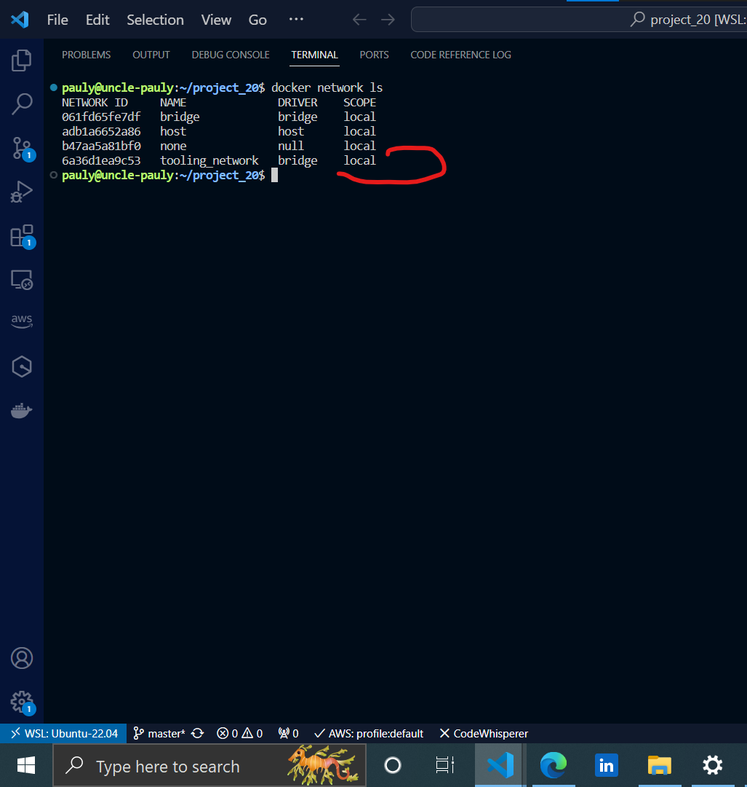
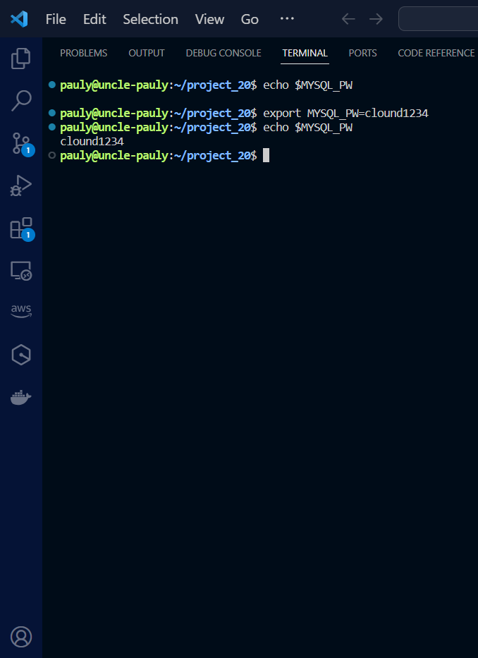
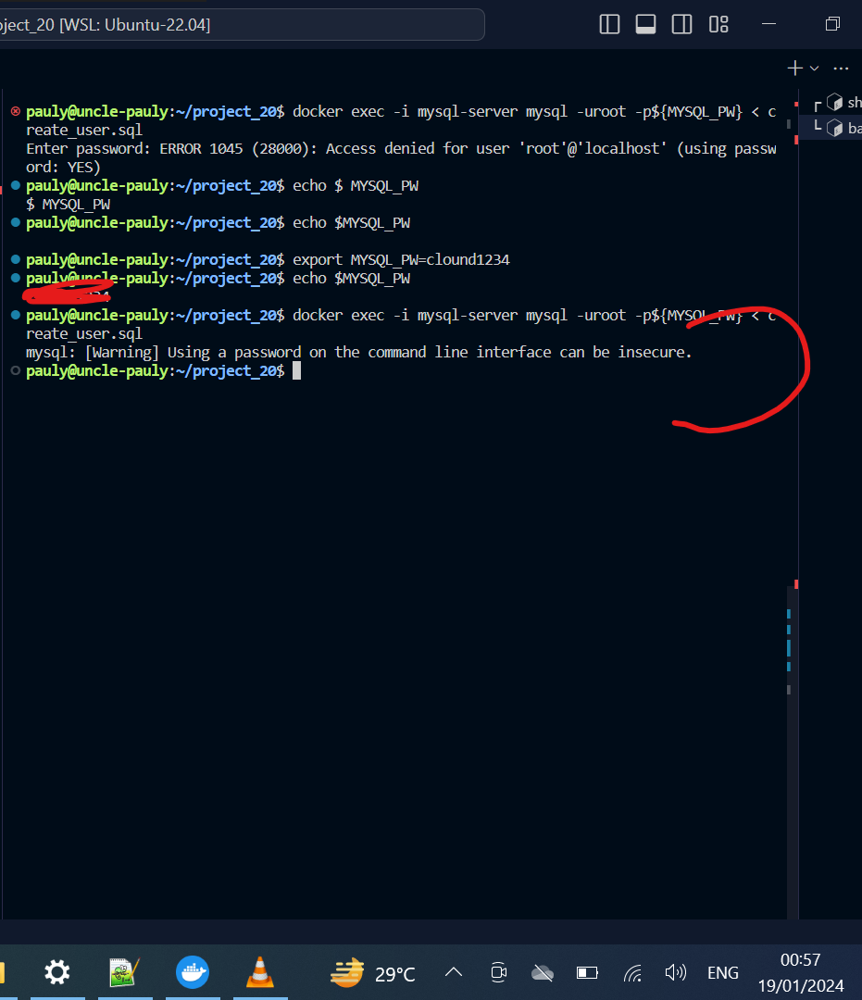

# MIGRATION TO THE СLOUD WITH CONTAINERIZATION. PART 1 – DOCKER & DOCKER COMPOSE

Never forget that the goal of DevOps is to make the software delivery process efficient, we've seen how we can use aid our strive towards this goal by this using IAC i.e terraform, we are going to use another tool today that is widely used by DevOps engineers to improve the efficiency of software delivery, DOCKER.

Later on we will add a CI tool i.e jenkins to achieve a multi-branch pipeline

  We will be deploying the tooling app packed with it's MySql backend using containers.

# We will be containerizing the tooling application i.e both the frontend and backend, and of course we will be automating the containerization. First we will do it manually, kinda like a test run, then we will add continous integration and automation.


### Deploy MySql in a container.
 We start be assembling the database layer of the tooling application. Pull a MySql container, configure it, and make sure it
is ready to receive requests from our PHP application.

#### First create a network 
Applications created in the same network will be able to talk to each other using  just their container names, there will be no need to set up network rules to enable their connectivity to each other as they are already in the same network. 
Sometimes there might be a requirement to control the cidr range of the containers running the entire application stack, in these scenarios we will create a network and specify the --subnet.

In this instance we will be doin likewise, we will create a network with a subnet dedicated for our project and use it for both MySQL and the application  so that they can connect.


```
$docker network create --subnet=10.0.1.0/24 tooling_network

$docker network ls
```



#### Pull and run mysql container
```
$ docker run --network tooling_network -h mysqlhostserver --name=mysql -e MYSQL_ROOT_PASSWORD=<set a password> -d mysql/mysql-server:latest

$docker ps -a
```
Flags used

- -d runs the container in detached mode
- --network connects a container to a network
- -h specifies a hostname


### Connecting to the running MySQL container.

We can either connect directly to the container running the MySQL server or use a second container as a MySQL client.

#### **Approach 1**:

we connect directly to the server running the container: We can do this in 2 ways:


`docker exec -it <container_name/id> bash`
  - `docker exec -it mysql-server bash`
 
**OR**

`docker exec -it <container_name/id> <COMMAND>`
  - `docker exec -it mysql mysql -uroot -p`

This first way takes us inside the container and opens a bash terminal while the second way runs whatever command we intend to run in the container from our terminal. In this case it prompts us to provide the root password, on doing that we will have sucessfully connected the MySQL client to the server 
Flags used

- exec used to execute a command from bash itself
- -it makes the execution interactive and allocate a pseudo-TTY
- bash this is a unix shell and its used as an entry-point to interact with our container
- mysql The second mysql in the command "docker exec -it mysql mysql -uroot -p" serves as the entry point to interact with mysql
 container just like bash or sh
- -u mysql username
- -p mysql password

Delete the container and the image and let's see approach 2
`docker stop <container_id> && docker remove <container_id> && docker rmi <image id>`

#### **Approach 2**:
Using this approach we will connect to the MySQL server from a MySQL client running in a different container

- We will first create a network, since we have already done this there is no need to repeat the network creation step
- create an env variable to store the root password.

#### Create an environment variable to run the root password of the msql
```
$export MYSQL_PW= *****

$echo $MYSQL_PW
```


#### Pull and run the mysql server image

```
docker run --network tooling_network -h mysqlhostserver --name=mysql-server -e MYSQL_ROOT_PASSWORD=${MYSQL_PW} -d mysql/mysql-server:latest
```

To connect with the server,
It is not encouraged to connect to the MySQL server remotely using the root user, there are security risks to doing this. The workaround this is to use a SQL script to create a user we can use to connect to the server remotely.

- create a file named `create_user.sql` and add the code below to it:
```
 CREATE USER 'pauly'@'%' IDENTIFIED BY 'pauly1234'; 
 GRANT ALL PRIVILEGES ON * . * TO 'pauly'@'%';
```


- Run the script, ensure you are in the directory where the script is located
```
docker exec -i mysql-server mysql -uroot -p${MYSQL_PW} < create_user.sql
```
Check if the user was created:

Database before applying script


Database after applying script


If you see a warning like below, it is acceptable to ignore:



#### Connect to the MySQL server from a second container running the MySQL client utility

We will connect to the MySQL server from a second container running the MySQL client. Using this approach we don't have to install any client tool on our local laptop and there's no need to connect directly to the container running the MySQL server

- Run the MySQL client container:
```
 docker run --network tooling_network --name mysql-client -it --rm mysql mysql -h mysqlhostserver -u pauly  -p 
```


- --name gives the container a name
- -it runs in interactive mode and Allocate a pseudo-TTY
- --rm automatically removes the container when it exits
- --network connects a container to a network
- -h a MySQL flag specifying the MySQL server Container hostname
- -u user created from the SQL script
- admin username-for-user-created-from-the-SQL-script-create_user.sql
- -p password specified for the user created from the SQL script


#### Prepare Database Schema

Next we prepare a database schema so the tooling app can connect to it, we already hava a script that creates the database and prepares the database schema in repo containing the toolins app source code.

- Clone the tooling app repo:

```
git clone git@github.com:NyerhovwoOnitcha/tooling.git
```

- Export the location of the SQL file as an env 

```
export tooling_db_schema=/home/pauly/Containerization/tooling/html/tooling_db_schema.sql
echo $tooling_db_schema
```

- Use the SQL script to create the database and prepare the schema. With the docker exec command, you can execute a command in a running container.

```
 docker exec -i mysql-server mysql -uroot -p${MYSQL_PW} < $tooling_db_schema 
```

-  Update the .env file with connection details to the database The .env file is located in the html tooling/html/.env folder

```
sudo vi .env

MYSQL_IP=mysqlserverhost
MYSQL_USER=username
MYSQL_PASS=client-secrete-password
MYSQL_DBNAME=toolingdb 

WHERE:
- MYSQL_IP mysql ip address "leave as mysqlserverhost"
- MYSQL_USER mysql username for user export as environment variable
- MYSQL_PASS mysql password for the user exported as environment varaible
- MYSQL_DBNAME mysql databse name "toolingdb"

```

### Containerize the Tooling app.
- Create the dockerfile, run the build command, and launch the container.

- Build the tooling image
```
docker build -t tooling:1.0.0 .
```


- Run the container

```
docker run --network tooling_network -p 8085:80 -it
tooling:1.0.0
```


If the mysql-server container is not running and you try to connect to localhost:8085, you get the following error:
```

Warning: mysqli::__construct(): php_network_getaddresses: getaddrinfo failed: Temporary failure in name resolution in /var/www/db_conn.php on line 27

Warning: mysqli::__construct(): (HY000/2002): php_network_getaddresses: getaddrinfo failed: Temporary failure in name resolution in /var/www/db_conn.php on line 27
Connection failed: php_network_getaddresses: getaddrinfo failed: Temporary failure in name resolution
```


#### Now write a Jenkinsfile that will simulate a Docker Build and a Docker
Push to the registry

### Create a new branch called todo, connect your repo to jenkins, create a multibranch pipepline that ultimately simulates a Docker build and push to your Docker repo
😊

### DOCKER COMPOSE
Imagine you are managing 10 docker containers for different applications and you are runing different commands for each, this will make things all over the place.  

With docker compose we can take all the commands and map them into a file so that we have structured commands. 
You write all the commands for each container in a structured way inside a  docker compose file, that way not only are you in total control of everything that is being done but you also have a point of refence to check the history of every command that has been run for all containers making managing your containers easier.

Basically docker compose is just a structured way to run the docker commands you already know.


<!-- - Pull the container:

    `docker pull mysql/mysql-server:latest`

- Run the Container:

 `docker run --name <container_name> -e MYSQL_ROOT_PASSWORD=<my-secret-pw> -d mysql/mysql-server:latest`

- Connect to the container, this can be in 2 ways:

 `docker exec -it mysql bash` or `docker exec -it mysql mysql -uroot -p`

- exec used to execute a command from bash itself
- it makes the execution interactive and allocate a pseudo-TTY
- bash this is a unix shell and its used as an entry-point to interact with our container
- mysql The second mysql in the command "docker exec -it mysql mysql 
- uroot -p" serves as the entry point to interact with mysql container just like bash or sh
-u mysql username
-p mysql password


Remember that unlike vms' containers are not meant to host ans OS, they are meant to run a specific task or process, once the task is complete the containers exit thus, **the container inly lives as long as the process inside it is alive** -->